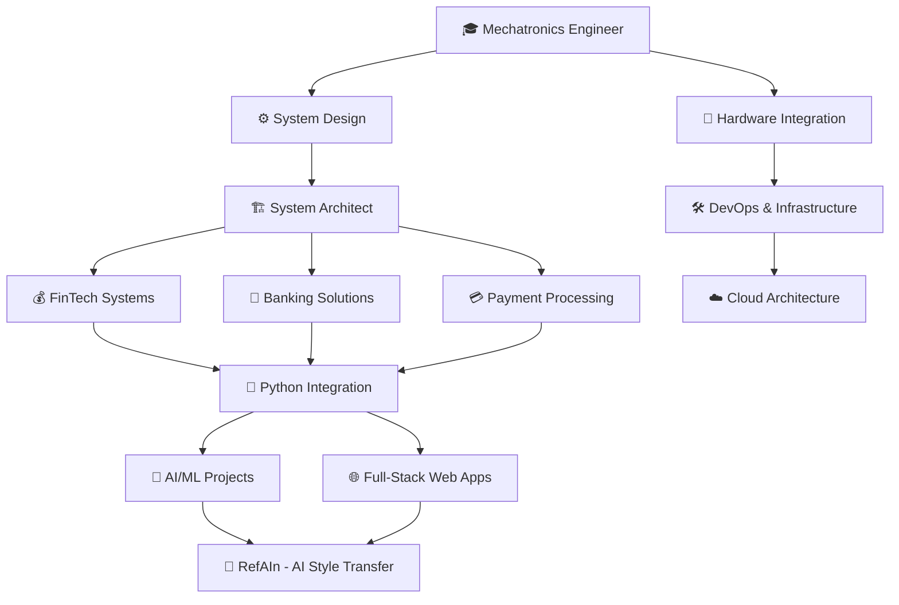

<div align="center">

```
╔══════════════════════════════════════════════════════════════════╗
║                    ⚔️  PLAYER PROFILE LOADED  ⚔️                 ║
╚══════════════════════════════════════════════════════════════════╝
```

# 🎮 ROBERT "REUZ93" GARCÍA
### 『 System Architect 』•『 Mechatronics Engineer 』•『 Code Warrior 』

   

</div>

---

## 📊 CHARACTER STATS

```
╔════════════════════════════════════════════════════════════╗
║  ATTRIBUTE          LEVEL    PROGRESS                      ║
╠════════════════════════════════════════════════════════════╣
║  🧠 Intelligence     [███████████████████░] 95%           ║
║  ⚡ Agility          [███████████████░░░░░] 75%           ║
║  🔧 Engineering      [████████████████████] 99%           ║
║  💰 FinTech Mastery  [██████████████████░░] 90%           ║
║  🐍 Python Power     [████████████░░░░░░░░] 60% ↗️         ║
║  🏗️  Architecture     [███████████████████░] 95%           ║
║  ⚔️  Problem Solving  [████████████████████] 100%          ║
║  🎯 Focus            [██████████████████░░] 88%           ║
╚════════════════════════════════════════════════════════════╝

💎 Total XP: 999,999,999  |  🏆 Achievements: 47/100  |  ⭐ Prestige: X
```

---

## 🎯 ACTIVE QUESTS

<table>
<tr>
<td width="50%">

### 🔥 MAIN QUEST
```diff
+ [ONGOING] Master the Python Arts
! Difficulty: ⭐⭐⭐⭐
@ Reward: +5000 XP, New Skill Tree
# Progress: 60%
```

</td>
<td width="50%">

### ⚡ SIDE QUESTS
```yaml
☑️ Conquered Financial Systems
☑️ Mastered Payment Gateways
☑️ Engineered Banking Solutions
🔄 Building AI-Powered Apps
🔄 Exploring Web3 & Blockchain
```

</td>
</tr>
</table>

---

## 🗡️ SKILL TREE



---

## 🎒 INVENTORY & EQUIPMENT

<div align="center">

### ⚔️ WEAPONS (Languages)


### 🛡️ ARMOR (Frameworks)


### 💎 ARTIFACTS (Tools & Tech)


### 🔮 SPECIAL ITEMS (AI & APIs)


</div>

---

## 🏆 BOSS BATTLES (Major Projects)

<table>
<tr>
<td align="center" width="33%">

### 🎨 RefAIn
**AI Style Transfer**
`Difficulty: ⭐⭐⭐⭐⭐`
**Status:** ✅ DEFEATED

*Rails 8 • Gemini AI*
*Stripe • PostgreSQL*

</td>
<td align="center" width="33%">

### 👔 TachisBoutique
**Live Booking System**
`Difficulty: ⭐⭐⭐⭐`
**Status:** ✅ DEFEATED

*E-commerce • Real-time*
*Reservation Platform*

</td>
<td align="center" width="33%">

### 🔨 Auction Dev
**Ruby Project**
`Difficulty: ⭐⭐⭐`
**Status:** ✅ DEFEATED

*Bidding System*
*Real-time Auctions*

</td>
</tr>
</table>

---

## 🌟 ACHIEVEMENT SHOWCASE

<div align="center">

| 🏅 Achievement | Description | Unlocked |
|:---:|---|:---:|
| 🎓 | **Engineer Origins** - Mastered Mechatronics Engineering | ✅ |
| 🏗️ | **Architect Ascension** - Became System Architect | ✅ |
| 💰 | **FinTech Dominator** - Conquered Financial Systems | ✅ |
| 🏦 | **Banking Legend** - Engineered Banking Solutions | ✅ |
| 💳 | **Payment Master** - Built Payment Gateways | ✅ |
| 🐍 | **Python Apprentice** - Started Python Journey | ✅ |
| 🎨 | **AI Artist** - Deployed AI Style Transfer App | ✅ |
| 🔥 | **Code Warrior** - Committed 1000+ times | ✅ |
| 🌙 | **Night Owl** - Coded past 3 AM | ✅ |
| ☕ | **Coffee Legend** - Fueled by caffeine | ✅ |

</div>

---

## 📈 PLAYER STATISTICS

<div align="center">


[](https://git.io/streak-stats)

</div>

---

## 🎪 GUILDS & ALLIANCES

<div align="center">

```
╔═══════════════════════════════════════════════════════════╗
║  Connect with me across the multiverse:                   ║
╚═══════════════════════════════════════════════════════════╝
```

[](https://linkedin.com/in/your-profile)
[](https://twitter.com/your-handle)
[](mailto:your.email@example.com)
[](https://your-portfolio.com)

</div>

---

## 💬 LEGENDARY QUOTE

<div align="center">

```
┌──────────────────────────────────────────────────────────┐
│                                                          │
│  "In the realm of code, every bug is a boss to defeat,  │
│   every feature is a quest to complete, and every       │
│   deployment is a victory to celebrate."                │
│                                                          │
│                                    - Robert, The Coder  │
└──────────────────────────────────────────────────────────┘
```

</div>

---

## 🎮 DAILY CHALLENGES

<div align="center">

```javascript
const robert = {
  location: "Monterrey, Mexico 🇲🇽",
  currentClass: "System Architect",
  previousClass: "Mechatronics Engineer",
  specialization: ["FinTech", "Banking", "Payments"],
  currentlyLearning: ["Python Deep Dive", "AI/ML", "Web3"],
  lookingToCollaborate: true,
  funFact: "I architect financial systems by day, build AI apps by night",
  motto: "From hardware to software, mastering it all",

  dailyRoutine: function() {
    console.log("☀️ Wake up → ☕ Coffee → 💻 Code → 🏋️ Workout → 💻 Code → 🌙 Sleep");
  },

  weeklyGoals: [
    "Ship new feature ✅",
    "Learn something new 🔄",
    "Help a fellow dev 🤝",
    "Optimize performance ⚡",
    "Review PRs 👀"
  ]
};
```

</div>

---

<div align="center">

### 🔥 CURRENT COMBO STREAK


---

```
╔════════════════════════════════════════════════════════════╗
║  💪 Let's build something legendary together!              ║
║  📬 Open to collaboration on finance, tech, and AI         ║
║  🚀 Always ready for the next epic quest                   ║
╚════════════════════════════════════════════════════════════╝
```


**⭐ Level Up: Star my repos • 🎯 New Quest: Fork & Contribute • 💬 Social: Drop a message**

---

*Last Boss Battle: January 2026 • Next Update: In Progress • Game Mode: HARD*

</div>
