## Hi, I'm Rob Echeagaray 👋

**System Architect** | **Mechatronics Engineer** | **AI Enthusiast**

Building intelligent systems at the intersection of finance, technology, and artificial intelligence.

📍 Monterrey, Mexico • 🔗 [LinkedIn](https://linkedin.com/in/your-profile) • 📧 [Email](mailto:your.email@example.com)

---

### About Me

I'm a System Architect with a background in Mechatronics Engineering, specializing in financial technology and payment systems. Currently exploring the frontiers of artificial intelligence and building production-ready AI applications.

```python
class Developer:
    def __init__(self):
        self.name = "Rob Echeagaray"
        self.role = "System Architect"
        self.location = "Monterrey, MX"
        self.focus = ["AI/ML", "FinTech", "Full-Stack Development"]

    def current_work(self):
        return {
            "learning": ["AI Mastery", "Advanced ML Techniques"],
            "building": ["AI-powered applications", "POS systems"],
            "exploring": ["Kotlin", "Vibe coding practices"]
        }
```

---

### Tech Stack

**Languages & Frameworks**
- Python, Ruby on Rails
- SQL (PostgreSQL)

**AI & Tools**
- OpenAI API
- Google Gemini
- Claude Code
- GitHub

**Specializations**
- Financial Systems Architecture
- Payment Gateway Integration
- AI/ML Application Development
- Full-Stack Web Development

---

### Current Projects

#### 🎨 [RefAIn](https://github.com/Reuz93/RefAIn)
AI-powered style transfer application built with Rails 8, Google Gemini API, and Stripe integration.
**Tech:** Rails • Gemini AI • PostgreSQL • Stripe

#### 👔 [TachisBoutique](https://github.com/Reuz93/TachisBoutique)
Live booking and reservation platform for retail e-commerce.
**Tech:** Real-time systems • E-commerce

#### 🔨 [Auction Dev](https://github.com/Reuz93/Auction_dev)
Real-time auction and bidding system.
**Tech:** Ruby • WebSockets

---

### What I'm Working On

**Primary Focus**
🤖 Mastering AI and machine learning implementations

**Active Initiatives**
- Vibe coding sessions and productivity experiments
- Kotlin development for Android/backend systems
- Point-of-Sale (POS) system development

---

### GitHub Stats

<div align="center">



[](https://github.com/Reuz93)


</div>

---

### Professional Experience

**System Architect** • Financial Technology
Architected and implemented solutions for:
- Financial transaction systems
- Payment gateway integrations
- Banking platform infrastructure
- High-volume, mission-critical applications

**Core Competencies**
- System Design & Architecture
- FinTech & Payment Processing
- Database Design & Optimization
- API Development & Integration
- AI/ML Implementation

---

### Let's Connect

I'm always interested in collaborating on innovative projects, especially in:
- AI/ML applications
- Financial technology
- System architecture challenges
- Open source contributions

Feel free to reach out for collaboration opportunities or technical discussions.

[](https://linkedin.com/in/your-profile)
[](mailto:your.email@example.com)
[](https://github.com/Reuz93)

---

<div align="center">
<sub>💡 Open to interesting opportunities and collaborations</sub>
</div>
