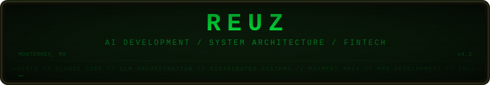
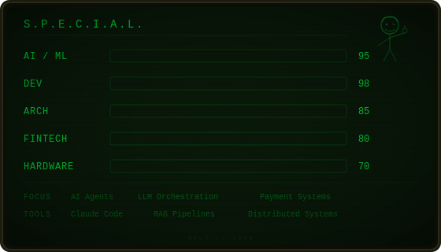
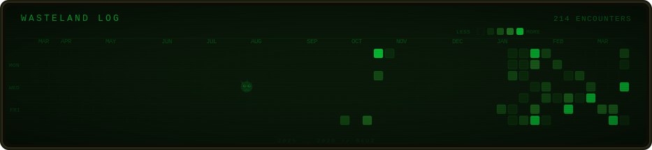
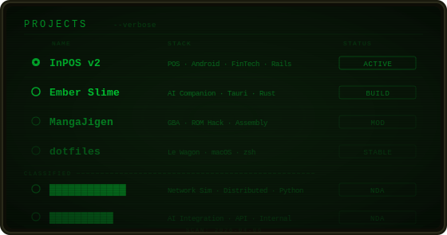

<div align="center">



<br/>



<br/>



<br/>



<br/>

[](https://github.com/Reuz93)

```
 ╔══════════════════════════════════════════════════════════╗
 ║                                                        ║
 ║   Kotlin // TypeScript // Python // Ruby // Rails      ║
 ║   Claude Code // Verifone POS // Android // Linux      ║
 ║   PostgreSQL // Node.js // Gemini // OpenAI            ║
 ║                                                        ║
 ╚══════════════════════════════════════════════════════════╝
```


</div>
